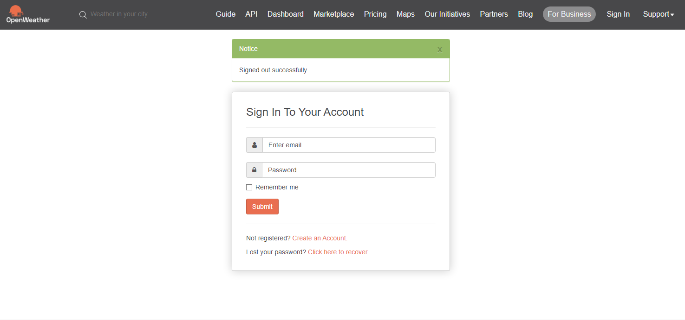
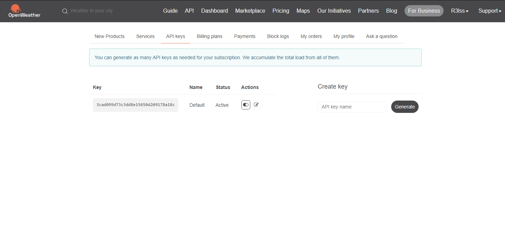

# Projeto Site Clima

Um site de clima dinâmico que fornece informações meteorológicas em tempo real para qualquer localidade do mundo, disponibilizando informações de até 5 dias, como é permitido com o plano de graça da [OpenWeather](https://openweathermap.org). Utilizando HTML, CSS e JavaScript, o site oferece uma interface amigável e responsiva. A integração com a API da OpenWeather permite a exibição precisa de dados como temperatura, umidade, velocidade do vento e condição climática atual.

## Funcionalidades

- **Pesquisa por Cidade:** Insira o nome de qualquer cidade para obter as condições climáticas atuais.
- **Dados em Tempo Real:** Atualizações instantâneas das informações meteorológicas através da API da OpenWeather.
- **Interface Responsiva:** Layout adaptável a diversos tamanhos de tela, garantindo uma boa experiência em dispositivos móveis e desktops.
## Site Live

[Site]()

## Como Utilizar

1. Clone o repositório:

```bash
  git clone https://github.com/seu-usuario/weathernow.git
```

2. Navegue até o diretório do projeto:

```bash
  cd weathernow
```

3. Abra com a sua IDE

```bash
  code .
```

4. Abra com Live Server

```bash
  npm run start
```


## Configuração da API com sua chave

Para usar a API da OpenWeather, você precisará de uma chave de API:
1. Crie uma conta na [OpenWeather](https://openweathermap.org) e obtenha sua chave de API.



2. Ao criar sua conta clique no seu nome no canto superior direito e vá em `My API keys`, lá vai estar a chave que você consegue usar, caso não tenha nada, é necessário que valide o e-mail utilizado



3. No código, substitua `chave_api` no arquivo `api,js` pela sua chave de API
```bash
  const chave_api = '3cad099d73c3dd8e15650d209178a18c';
```

## Licença

Este projeto está licenciado sob a MIT License - veja o arquivo [MIT](https://choosealicense.com/licenses/mit/)  para mais detalhes.
